# Nahranie TeamSpeak3 zálohy

## Úvod

Tento návod vás prevedie procesom, ako **nahrať TeamSpeak3 zálohu** pomocou nástroja ****[**YaTQA**](https://yat.qa/herunterladen/).

## Budete potrebovať

* **TeamSpeak3** server
* Stiahnutý a nainštalovaný nástroj [**YaTQA**](https://yat.qa/herunterladen/) **\(**[**https://yat.qa/herunterladen/**](https://yat.qa/herunterladen/)**\)**
* Prístupové údaje do **Query** \(**serveradmin**\)

## Postup

1. Prihláste sa do hernej administrácie na [https://panel.batcore.eu](https://panel.batcore.eu/)  
2. Zvoľte server, na ktorý chcete zálohu nahrať.

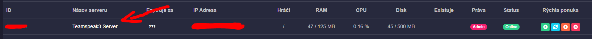

3. Na zvolenom servery vyberte záložku **Parametre spustenia**

4. Nájdite položku **Query Heslo** a zadajte heslo, ktoré máte v pláne používať.  
5. **Uložte** zmeny a **reštartujte server**. \(Ak bol vypnutý, tak stačí zapnúť.\)

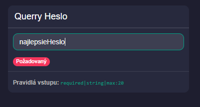

6. **Spustite** nástroj **YaTQA** a **otvorte nestavenia** \(Settings...\)  
7. V nastaveniach **zaškrtnite pole**:

* [x] **Allow connecting to a non-default query port**

8. Podvrďte zmeny pomocou **OK**.

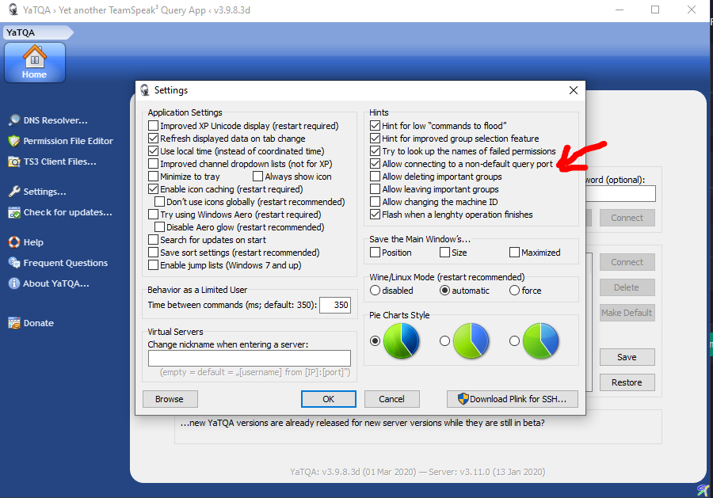

9. **Zadajte údaje** ktoré nájdete v adminsitrácii **a kliknite Connect.**  
**Server address** - IP serveru \(Bez portu\)  
**Query port** - Port serveru  
**Username** - `serveradmin`  
**Password** - Heslo, ktoré ste nastavili v **kroku 4.** 

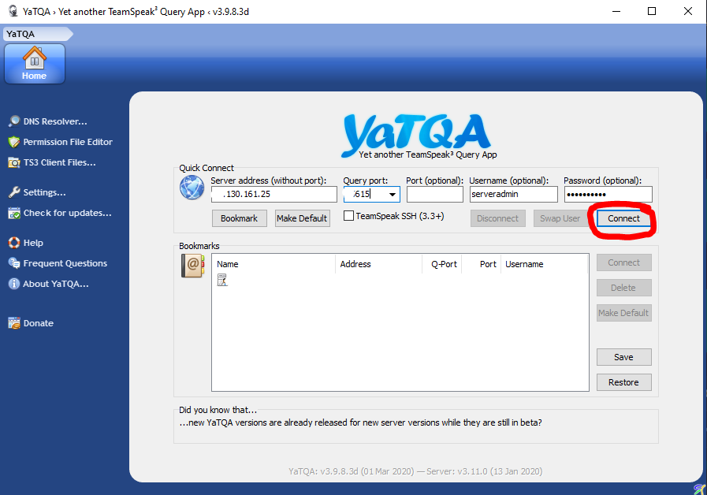

10. Po úspešnom pripojení **kliknite** na záložku **Servers**.

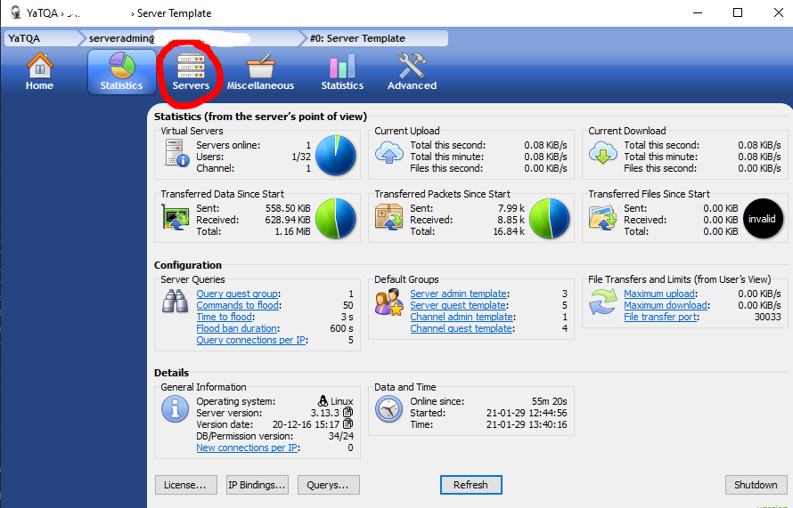

11. **Označte** server a **kliknite Select**.

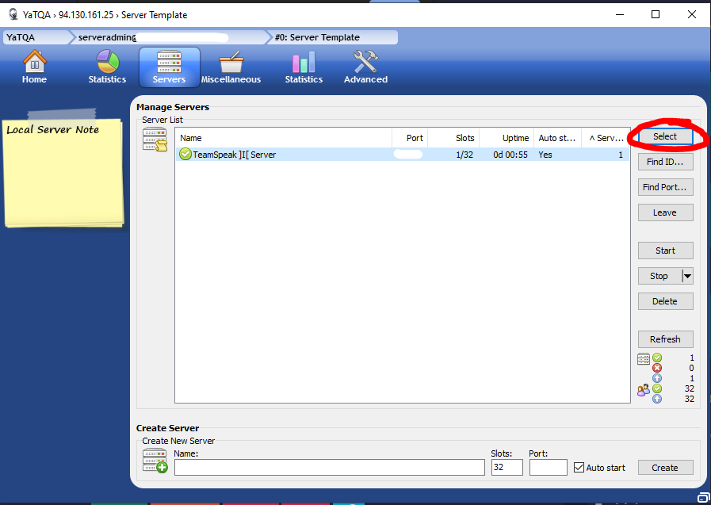

12. **Kliknite** na záložku **Miscellaneous**.

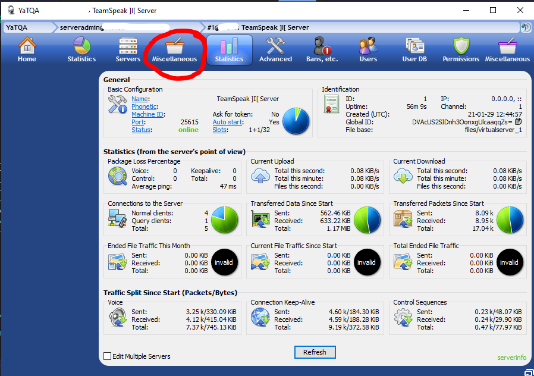

13. **Kliknite** na odkaz **Restore snapshot**.

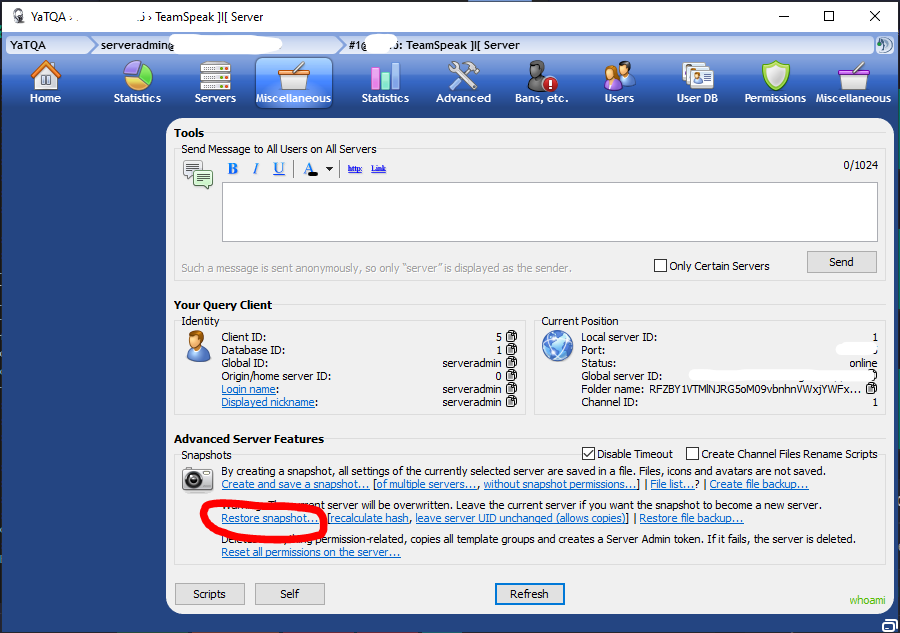

14. **Vyberte súbor** zálohy.

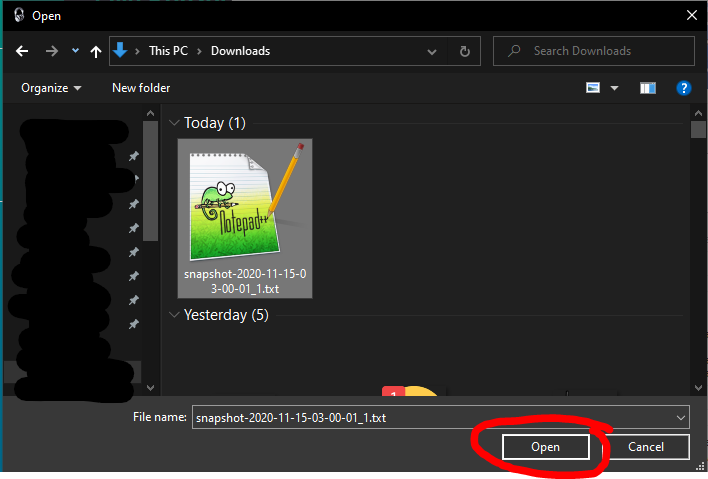

15. Potvrďte pomocou **Yes.**

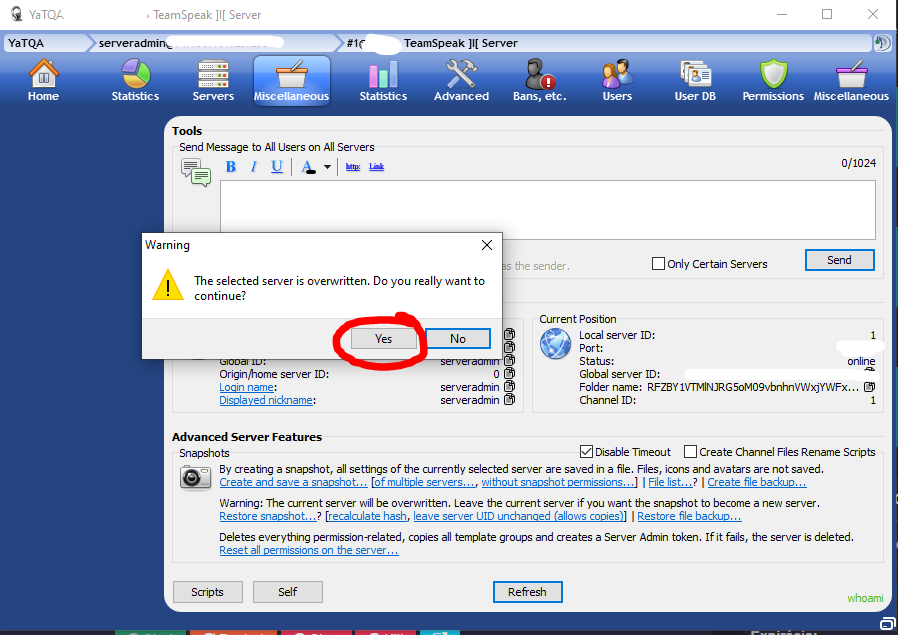

  
16. Potvrďte pomocou **OK.**

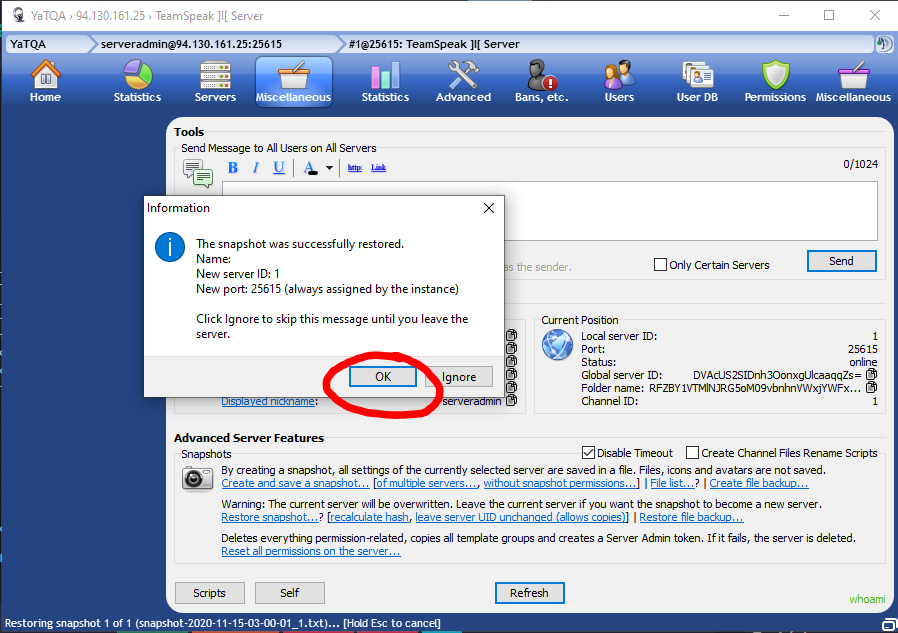

**17. Kliknite** na záložku **Servers**.

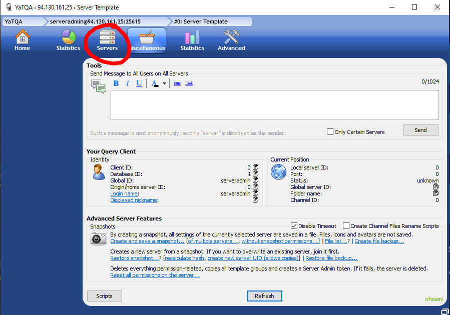

18. Znovu o**značte** server a **kliknite Select**.

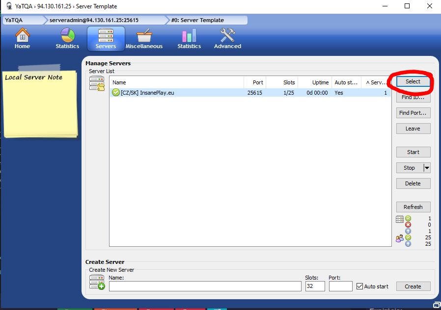

19. **Kliknite** na odkaz **Slots**.

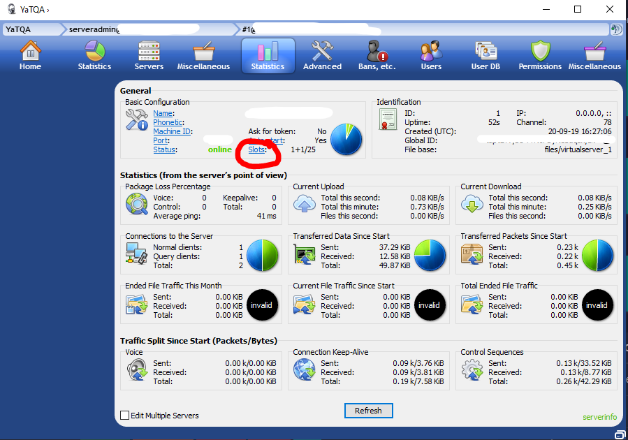

20. Nastavte **sloty na 32** a potvrďte pomocou **OK**.

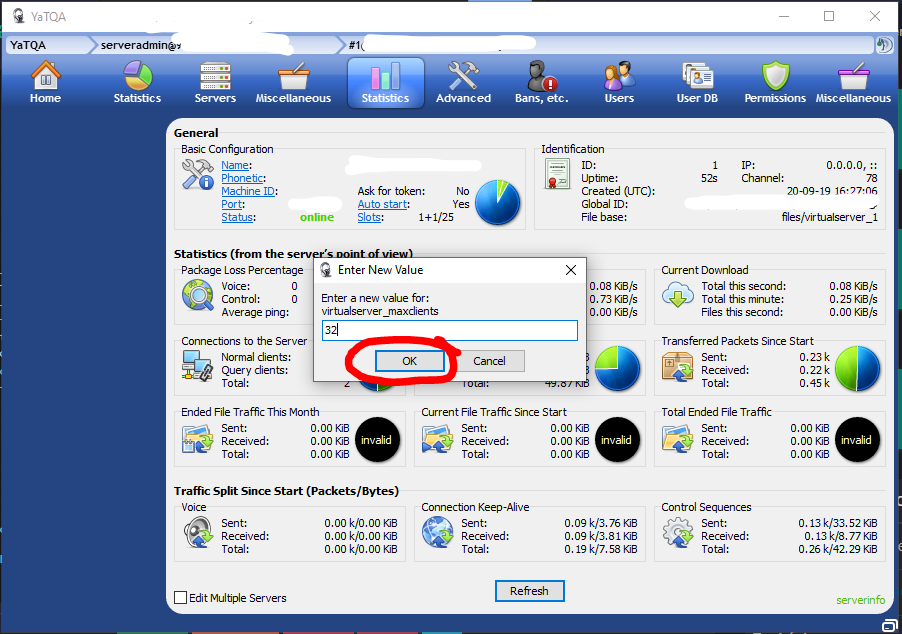

## Záver

Ďakujem za dočítanie návodu.  
Nezabudnite zareagovať pomcou smajlíka dole 😇 

